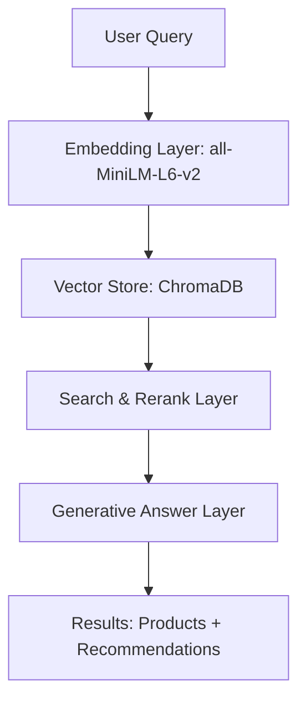

# 🛍️ Retrieval-Augmented Generation (RAG) on Myntra Fashion Data  


---

## 📌 Project Overview
This project implements a **Retrieval-Augmented Generation (RAG)** pipeline for personalized **fashion product search and recommendations**.  
It uses **embeddings + vector search (ChromaDB) + reranking + generative answers** to respond to natural language queries like:

> *"Red floral kurta"* → returns top product matches with brand, colour, price, and image preview.

---

## 🗂 Dataset
- **Source**: [Myntra Fashion Product Dataset (Kaggle)](https://www.kaggle.com/datasets/djagatiya/myntra-fashion-product-dataset)
- **Size**: ~14,000 products
- **Fields used**:  
  - `name` (title)  
  - `brand`  
  - `colour`  
  - `price`  
  - `img` (image URL)  
  - `p_id` (product ID)  
  - `products` (category/text description)  

Data cleaning involved handling nulls, normalizing text, and creating a `text` field for embeddings.

---

## ⚙️ System Architecture

---

## 🚀 Implementation Highlights
- **Batch-safe indexing** (`MAX_BATCH = 1000`) to avoid ChromaDB errors  
- **Recommendation function**:

```python
def recommend(query, n=5):
    results = collection.query(query_texts=[query], n_results=n)
    recs = []
    for meta in results['metadatas'][0]:
        recs.append({
            "name": meta['name'],
            "brand": meta['brand'],
            "colour": meta['colour'],
            "price": meta['price'],
            "image": meta['img']
        })
    return pd.DataFrame(recs)
```

- Inline **HTML image rendering** in Jupyter for better visualization  
- JSON output with **reranked results + similarity score**  

---

## 📊 Example Query
**Input**: `"Red floral kurta"`  

**Output** (sample):
```json
{
  "name": "Floral Print Kurta",
  "brand": "BrandX",
  "colour": "Red",
  "price": "₹999",
  "img": "https://...",
  "score": 0.8943
}
```

---

## ✅ Evaluation
- **Qualitative**: Visual inspection of retrieved sets  
- **Planned**:  
  - Retrieval precision/recall  
  - Embedding similarity distribution  
  - Human evaluation of recommendation relevance  

---

## 💡 Applications
- Conversational shopping assistant  
- Personalized search engine  
- Cross-sell & up-sell in e-commerce  

---

## 🔮 Future Enhancements
- Integrate **cross-encoder rerankers**  
- Add **LLM summarization** (*e.g., "5 red kurtas under ₹1000"*)  
- Deploy via **Streamlit/Gradio**  
- Experiment with larger embedding models (`all-mpnet-base-v2`)  
- Add proper **RAG evaluation metrics**  

---

## 📂 Repository Structure
```
├── Helpmate_assistant_PrakashDannySagar_MyntraFashionData.ipynb   # Main notebook
├── RAG_Myntra_Project_Report.docx                                 # Word report
├── RAG_Myntra_Project_Report_with_Figures.docx                    # Report with images/plots
├── README.md                                                      # This file
└── rag_figures/                                                   # Extracted plots & figures
```

---

## 👨‍💻 Author
**Prakash Danny Sagar A**  
AI/ML & Business Strategy Projects | Pharma | E-commerce | Carbon Credits  

🌐 [LinkedIn](https://www.linkedin.com) | [GitHub](https://github.com)  

